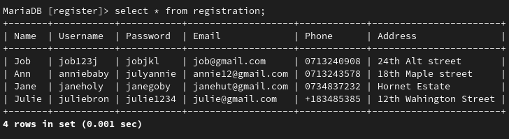

# Registration
Simple registration form in Java
 

 

 

# How to use
`Create a database called register using mysql using specified schematics`
 
`Clone the project onto your system`
 
`Open the project in intellij idea`
 
`Run registration.java and enter data to your heart's content`
 
`Click submit and enjoy the results`
